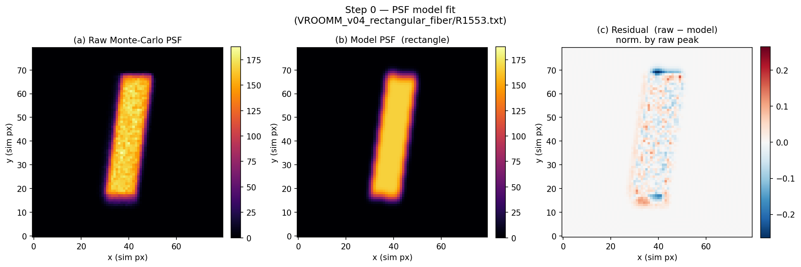
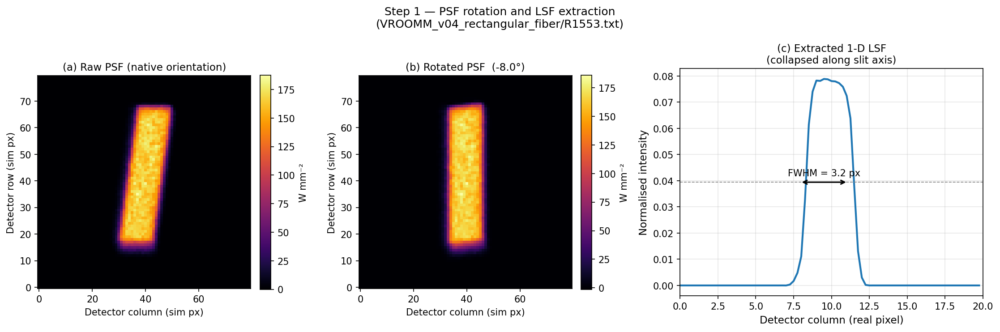
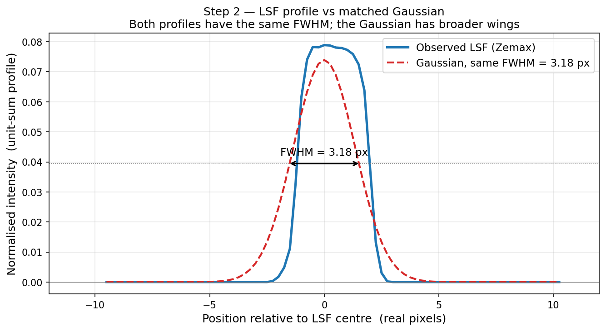
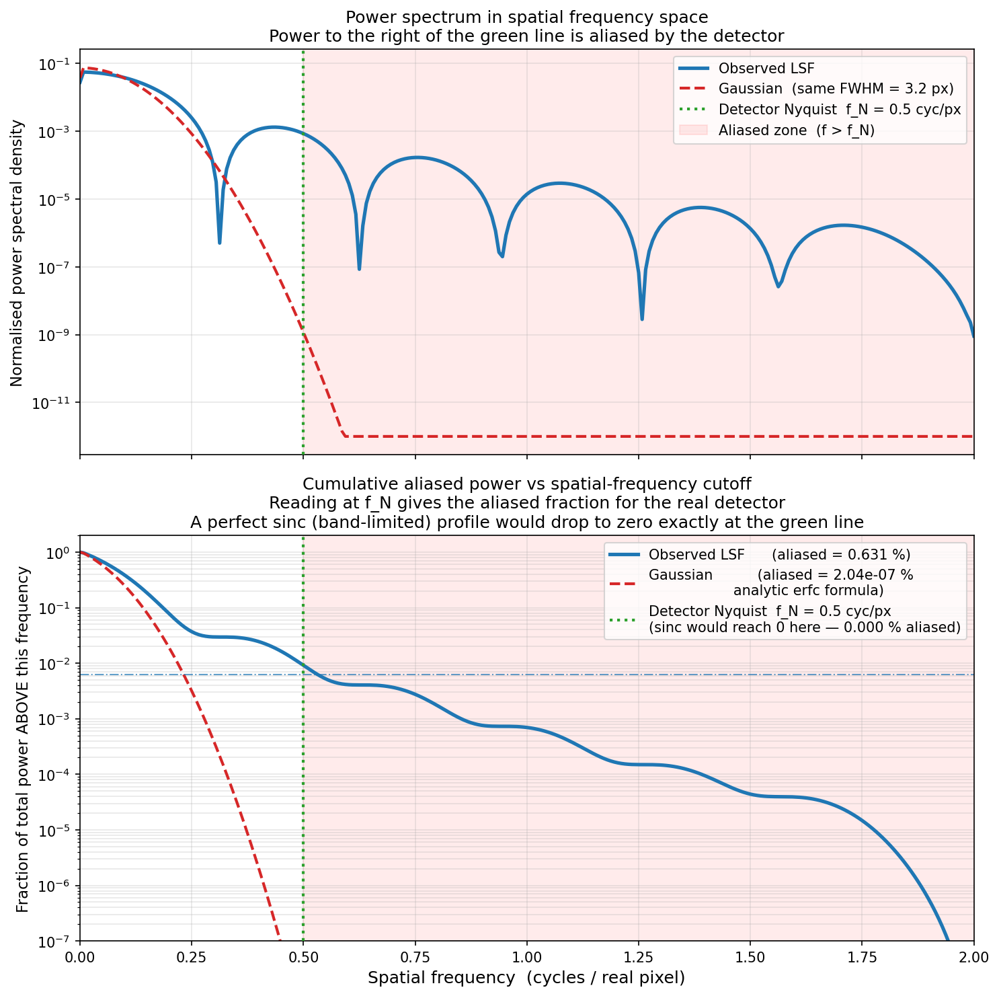
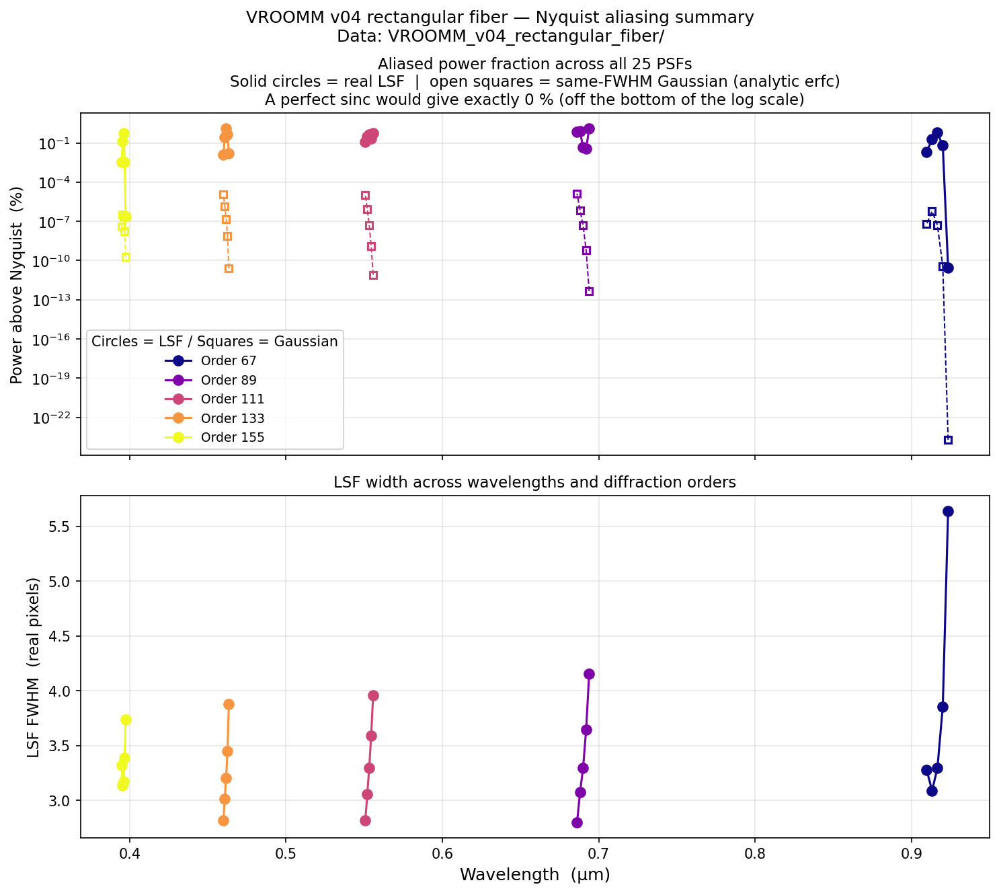
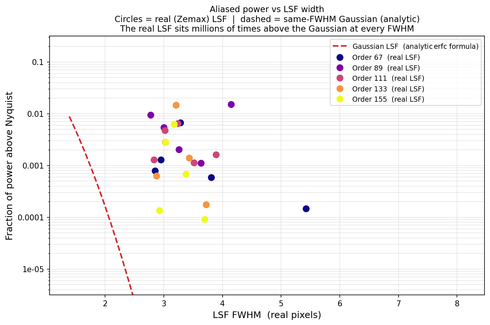

# LSF Nyquist Analysis

*How much of the spectrograph Line Spread Function is aliased by the detector?*

> **For the impatient:**
> ```bash
> git clone https://github.com/eartigau/nyquist_lsf.git
> cd nyquist_lsf
> pip install numpy matplotlib scipy pyyaml
> python lsf_nyquist.py
> ```
> Four PNG figures appear in the folder.  Everything you can customise lives in `config.yaml`.

---

## Table of Contents

1. [What this code does](#1-what-this-code-does)
2. [The physics — what is Nyquist aliasing?](#2-the-physics--what-is-nyquist-aliasing)
3. [Prerequisites](#3-prerequisites)
4. [Getting the code](#4-getting-the-code)
5. [Running the code](#5-running-the-code)
6. [Configuration — `config.yaml`](#6-configuration--configyaml)
7. [Understanding the output figures](#7-understanding-the-output-figures)
   - [Figure 0 — PSF model diagnostic](#figure-0--fig_00_psf_modelpng--model-mode-only) *(when `psf_model.enabled: true`)*
   - [Figure 1 — PSF rotation](#figure-1--fig_01_psf_rotationpng)
   - [Figure 2 — LSF vs Gaussian profiles](#figure-2--fig_02_lsf_profilespng)
   - [Figure 3 — Power spectra](#figure-3--fig_03_power_spectrapng)
   - [Figure 4 — Summary over all LSFs](#figure-4--fig_04_summarypng)
   - [Figure 5 — Aliased power vs FWHM](#figure-5--fig_05_aliasing_vs_fwhmpng)
8. [Using your own data](#8-using-your-own-data)
9. [Key results at a glance](#9-key-results-at-a-glance)
10. [FAQ / Troubleshooting](#10-faq--troubleshooting)

---

## 1. What this code does

A spectrograph disperses light onto a 2-D detector.  Each spectral line
produces a small blob on the detector called a **Point Spread Function (PSF)**.
If you collapse the PSF along the slit direction you get a 1-D profile called
the **Line Spread Function (LSF)**.  The LSF is the spectrograph's impulse
response in the wavelength direction: the sharper (narrower) it is, the better
your spectral resolution.

But the LSF is not sampled continuously — it is sampled by discrete detector
pixels.  The Nyquist–Shannon theorem tells us there is a maximum spatial
frequency the detector can faithfully measure.  Any LSF power *above* that
frequency leaks into lower frequencies, distorting the measured line profile.
This effect is called **aliasing**.

This code:

1. Reads simulated PSF maps exported from **Zemax** (a ray-tracing program).
2. Optimally rotates each PSF so the dispersion direction aligns with the
   pixel columns.
3. Collapses the PSF to a 1-D LSF.
4. Computes the **fraction of LSF power above the Nyquist frequency** — the
   aliased power — via an FFT.
5. Compares with a **Gaussian** of identical FWHM (via an exact analytic
   formula).
6. Repeats for all 25 simulated field positions and makes summary plots.

---

## 2. The physics — what is Nyquist aliasing?

### 2.1 Digital sampling and the Nyquist frequency

Imagine shining a laser line onto your detector.  The detector records one
number per pixel; it cannot see structure finer than one pixel.  The
**Nyquist–Shannon sampling theorem** says:

> To faithfully represent a signal that oscillates at frequency *f*, you need
> at least **2 samples per oscillation cycle**.

A pixel detector with pitch *p* gives you 1 sample per pixel, so the highest
frequency it can faithfully represent is:

$$f_N = \frac{1}{2p} = 0.5 \text{ cycles per pixel}$$

This is the **Nyquist frequency**.  Any information at frequencies above $f_N$
is *aliased*: it folds back into lower frequencies and scrambles the signal.
There is no way to undo aliasing after the fact.

### 2.2 Power above Nyquist = aliased power

Every LSF profile can be decomposed into spatial frequencies by a Fourier
transform.  The fraction of total power that lives above $f_N$ tells you
directly how badly the detector misrepresents the line profile:

$$f_{\rm aliased} = \frac{\displaystyle\int_{f_N}^{\infty} \bigl|\hat{L}(f)\bigr|^2\, df}
                          {\displaystyle\int_{0}^{\infty}  \bigl|\hat{L}(f)\bigr|^2\, df}$$

where $\hat{L}(f)$ is the Fourier transform of the LSF.

### 2.3 Three reference cases — and why the real LSF is different

| Profile | Aliased fraction | Why |
|---------|-----------------|-----|
| **Sinc** | **exactly 0 %** | A sinc has a *rectangular* Fourier transform: all power is within a finite band.  If you design the instrument so that band fits below $f_N$, aliasing is zero by construction. |
| **Gaussian** | **~10⁻²² – 10⁻⁵ %** | A Gaussian has a Gaussian Fourier transform, which decays *super-exponentially* ($\propto e^{-f^2}$).  It technically extends to infinite frequency, but the power is so small above $f_N$ that it is negligible in practice.  The exact formula is $f_{\rm aliased}^{\rm Gauss} = \mathrm{erfc}(2\pi\sigma f_N)$. |
| **Real rectangular-fiber LSF** | **0.01 – 1.5 %** | A rectangular fiber aperture casts a slit image with *sharp edges*.  Sharp edges Fourier-transform to a sinc function, which decays only as $1/f$ — far slower than $e^{-f^2}$.  These slow-decaying tails fill in the frequency space above $f_N$ and create measurable aliased power. |

The bottom line: **the real LSF has 5–9 orders of magnitude more aliased power
than a Gaussian with the same FWHM**.  The Gaussian approximation
dramatically under-estimates how much high-frequency content the actual slit
image contains.

### 2.4 Why the Zemax data are oversampled

Zemax simulations run on a fine grid so the details of the PSF are well
resolved.  For the data in this repository:

- Real detector pixel size: **12 µm**
- Zemax simulation pixel: **3 µm** (= 12/4)
- Oversampling factor: **4×**

This means one "simulation pixel" is one quarter of a real detector pixel.
When the code converts frequencies, it multiplies by the oversampling factor
to express everything in units of **cycles per real pixel**.  The Nyquist
limit is always 0.5 cycles per real pixel regardless of oversampling.

### 2.5 The Monte-Carlo noise problem — why a smooth PSF model is needed

Zemax builds its PSF maps by tracing millions of rays through the optical
system and histogramming where they land.  Despite the large sample, each
pixel has Poisson-like scatter at the few-percent level — random, not optical.

When you take the FFT of a noisy image, that **white noise spreads power
uniformly across all spatial frequencies**, including the aliased zone above
$f_N$.  Without any correction, the measured aliased fraction is:

$$f_{\rm aliased}^{\rm measured} = f_{\rm aliased}^{\rm optical} + f_{\rm aliased}^{\rm noise}$$

For the VROOMM data the noise contribution can easily be the same order of
magnitude as the true optical signal, inflating the aliasing estimate by a
factor of several.

**The fix:** fit a smooth **parametric model** to each raw Zemax PSF and use
the noise-free model for all downstream FFT analysis.  The model captures
real optical structure (asymmetry, rotation, secondary lobes) but discards
the random pixel noise.  This is controlled by the `psf_model` block in
`config.yaml` (section 6).

---

## 3. Prerequisites

You need **Python 3.9 or later** and five standard scientific packages.

| Package | What it does here |
|---------|-------------------|
| `numpy` | Array maths, FFT |
| `matplotlib` | All figures |
| `scipy` | PSF rotation, 1-D optimiser, Nelder-Mead fitter, `erfc` |
| `pyyaml` | Read `config.yaml` |
| `astropy` | Read/write FITS cache files for the PSF model |

### Option A — conda (recommended if you are new to Python)

[Anaconda](https://www.anaconda.com/products/distribution) or
[Miniconda](https://docs.conda.io/en/latest/miniconda.html) includes
everything you need:

```bash
conda create -n nyquist python=3.11 numpy matplotlib scipy pyyaml astropy
conda activate nyquist
```

### Option B — pip (if you already have Python installed)

```bash
pip install numpy matplotlib scipy pyyaml astropy
```

To check everything is installed correctly:

```bash
python -c "import numpy, matplotlib, scipy, yaml, astropy; print('All good!')"
```

---

## 4. Getting the code

### Option A — git clone (easiest to update later)

If you have `git` installed:

```bash
git clone https://github.com/eartigau/nyquist_lsf.git
cd nyquist_lsf
```

### Option B — download a ZIP

1. Go to the GitHub repository page.
2. Click the green **"Code"** button near the top right.
3. Click **"Download ZIP"**.
4. Unzip the file somewhere convenient.
5. Open a terminal and `cd` into the unzipped folder.

To verify you are in the right place:

```bash
ls
```

You should see `lsf_nyquist.py`, `config.yaml`, and the
`VROOMM_v04_rectangular_fiber/` data folder.

---

## 5. Running the code

From inside the repository folder:

```bash
python lsf_nyquist.py
```

The script prints its progress to the terminal and saves up to six PNG figures.

**First run** (PSF model enabled): fitting the 25 PSFs with Nelder-Mead takes
roughly **2–5 minutes** total.  Each fitted model is cached as a FITS file in
`psf_models/`, so every subsequent run reads the cache and finishes in a few
seconds.

**With `psf_model.enabled: false`** (raw PSF mode): the only significant cost
is the rotation-angle search — about **30–60 seconds** for all 25 files.

Expected terminal output (model mode, first run):

```
Configuration loaded from config.yaml:
  example_file      : VROOMM_v04_rectangular_fiber/R1553.txt
  data_dir          : VROOMM_v04_rectangular_fiber
  detector_pixel_um : 12.0 µm
  sim_pixel_um      : 3.0 µm
  oversample        : 4.00×  (4× integer)
  n_fft             : 512
  output_dir        : /Users/.../nyquist_lsf
  psf_model         : ENABLED  type=rectangle  cache=psf_models  refit=False

Loading example PSF: VROOMM_v04_rectangular_fiber/R1553.txt
    fitting rectangle+Gaussian model to R1553.txt …
    model saved to psf_models/R1553_model.fits
Saved  ./fig_00_psf_model.png
Finding optimal rotation angle ...
  Optimal rotation : -8.16 °
  LSF FWHM         : 12.69 sim px  =  3.17 real px
  Aliased power — real LSF       : 0.5436 %
  Aliased power — Gaussian (analytic, erfc): 2.172e-07 %
  Aliased power — sinc           : 0.0000 %  (band-limited by definition)
Saved  ./fig_01_psf_rotation.png
...

Batch processing all LSFs in VROOMM_v04_rectangular_fiber/ ...
    fitting rectangle+Gaussian model to R671.txt …
    model saved to psf_models/R671_model.fits
  R671  λ=0.9235 µm  FWHM=5.64 real-px  aliased: LSF=0.0000%  Gauss=1.923e-24%
    ...
    loaded model from cache : psf_models/R1553_model.fits  ← already fitted above
    ...
Saved  ./fig_04_summary.png
Saved  ./fig_05_aliasing_vs_fwhm.png

All done.
```

On re-runs, the "fitting…" lines are replaced by "loaded model from cache: …" and
the script finishes in seconds.

---

## 6. Configuration — `config.yaml`

**All user-adjustable inputs live in `config.yaml`.**
Open it in any text editor.  Do not edit the Python source code.

Here is the file with detailed explanations of every parameter:

```yaml
# ── Data sources ───────────────────────────────────────────────────────────────

# Path to a single PSF file for the detailed single-case demo (Figures 1–3).
example_file: VROOMM_v04_rectangular_fiber/R1553.txt

# Folder for the batch analysis over all PSFs (Figure 4).
# Must contain R{order}{field}.txt files + one *_XY.txt companion file.
data_dir: VROOMM_v04_rectangular_fiber


# ── Detector geometry ──────────────────────────────────────────────────────────

# Physical size of one real detector pixel in micrometres.
# Check your detector's datasheet.  Typical values: 12–18 µm.
detector_pixel_um: 12.0


# ── Zemax simulation geometry ──────────────────────────────────────────────────

# Physical size of one Zemax simulation pixel in micrometres.
# Formula: sim_pixel_um = image_field_width_mm / n_pixels × 1000
# You can read image_field_width_mm and n_pixels from the header of any .txt file.
#
# Example (VROOMM v04):
#   Image Width = 0.24 mm,  Number of pixels = 80 × 80
#   sim_pixel_um = 0.24 / 80 × 1000 = 3.0 µm
#
# The code computes:  oversample = detector_pixel_um / sim_pixel_um
# A warning is printed if this is not close to a whole number.
sim_pixel_um: 3.0

# Number of header lines in each Zemax ASCII file before the data matrix.
# Count the lines above the first block of numbers in any .txt file.
zemax_header_lines: 17


# ── FFT settings ───────────────────────────────────────────────────────────────

# Zero-padding length for the power-spectrum curves in Figs. 2–3.
# rule of thumb: 512 gives smooth curves; 1024 if you want extra detail.
# Must be >= number of sim pixels across one PSF (typically 80).
n_fft: 512


# ── Output ─────────────────────────────────────────────────────────────────────

# Folder where the four PNG figures are written.
# Use  .  for the current directory, or give an absolute/relative path.
output_dir: .


# ── PSF model ──────────────────────────────────────────────────────────────────

# Zemax PSFs come from a Monte-Carlo ray-trace simulation and are noisy.
# That noise adds spurious high-frequency content and inflates the
# estimated aliased-power fraction.
#
# When  enabled: true , the script first fits a smooth parametric model
# to each PSF, then uses the model PSF for all downstream steps.
#
# Model geometry:  rectangle (half-widths a, b; shear; rotation)
#                  convolved with a 2-D rotated Gaussian (σ1, σ2; rotation)
# 9 free parameters, optimised with Nelder-Mead.
#
# Fitted models are cached as FITS files so re-running the script is fast.
# Set  refit: true  to force a fresh fit of every PSF (e.g. after the
# FITS cache folder is deleted or the model definition changes).

psf_model:
  enabled: true          # true = fit smooth model; false = use raw PSF
  type: rectangle        # only "rectangle" is currently implemented
  cache_dir: psf_models  # folder for FITS cache files (auto-created)
  refit: false           # true = ignore cache, refit every PSF
```

### How to find `sim_pixel_um` from a Zemax file

Open any `.txt` file in the data folder (e.g. `R1553.txt`) in a text editor.
The first ~17 lines look like this:

```
Image analysis histogram listing

File : C:\Users\...\design.ZMX
Title:
Date : 26/02/2026

Field Width  : 0.231 Millimeters
Image Width  : 0.24 Millimeters     ← use this number
Number of pixels  : 80 x 80         ← and this number
...
```

Then:

```
sim_pixel_um = (Image Width in mm) / (Number of pixels) × 1000
             = 0.24 / 80 × 1000
             = 3.0 µm
```

---

### How the PSF model works (rectangle + Gaussian)

This section gives the technical details of the model used when
`psf_model.enabled: true`.  You can skip it if you are only running the code;
read it if you want to understand what the fit is doing or diagnose a bad fit.

#### The physical picture

A rectangular fiber projects a slit image onto the focal plane.  To a good
approximation the PSF is a **sharp-edged rectangle** (from the fiber aperture)
blurred by the **telescope + spectrograph optics** (modelled as a 2-D
Gaussian).  The rectangle may be rotated on the detector due to anamorphism
and sheared along the dispersion direction if the slit is not perfectly
straight on the detector.

#### Model definition

The model PSF is:

```
M(x,y) = Rect(u, v;  a, b, shear, θ_rect)  ⊛  Gaussian(σ₁, σ₂, θ_gauss)
```

where `⊛` is 2-D convolution, computed via FFT multiplication for speed, and
the **9 free parameters** are:

| Parameter | Symbol | Meaning |
|-----------|--------|---------|
| Centroid column | c_x | PSF centre in x (sim px) |
| Centroid row | c_y | PSF centre in y (sim px) |
| Rectangle half-width (dispersion) | a | half-extent along u-axis (sim px) |
| Rectangle half-width (slit) | b | half-extent along v-axis (sim px) |
| Shear | s | slit tilt: v̂ = v − s·u |
| Rectangle rotation | θ_rect | angle of rectangle frame from pixel x-axis (°) |
| Gaussian σ, axis 1 | σ₁ | optics-blur scale along first eigen-axis (sim px) |
| Gaussian σ, axis 2 | σ₂ | optics-blur scale along second eigen-axis (sim px) |
| Gaussian rotation | θ_gauss | orientation of the Gaussian blur axes (°) |

The rectangle indicator is evaluated in the rotated+sheared frame `(u, v)`.  A
point `(x, y)` is inside the rectangle if `|u| ≤ a` **and** `|v − s·u| ≤ b`.

#### Optimisation

Initial parameter guesses are computed from the image's **first and second
moments** (centroid, moment eigenvalues → approximate half-widths and
orientation).  The 9 parameters are then refined by **Nelder-Mead simplex**
(`scipy.optimize.minimize`, gradient-free), minimising the sum of squared
pixel residuals between the normalised raw PSF and the normalised model.

Nelder-Mead is chosen because it is robust in high-dimensional spaces without
calculating gradients, and the parameter space here has narrow valleys (the
shear and two rotation angles are nearly degenerate at low shear).

Typical fit time: **5–15 s per PSF** on a modern laptop CPU.

#### FITS cache

Each fitted model is written to `<cache_dir>/<stem>_model.fits` as a 32-bit
float FITS image with header keywords recording the source filename and model
type.  On re-run, the cache file is loaded in milliseconds without refitting.

To **force a refit** (e.g. after changing the optical design or if a cached
fit looks wrong in `fig_00`), set `refit: true` in `config.yaml`, run the
script once, then set it back to `false`.

#### Diagnosing a bad fit

Open `fig_00_psf_model.png`.  The residual panel (c) should look like uniform
random noise with no coherent structure.  If you see:

- **Butterfly / dipole pattern in residuals** — the model is in the right
  place but the rectangle rotation or shear is slightly off.  Try setting
  `refit: true` and running again (the optimizer may have converged to a local
  minimum).
- **Ring pattern** — the Gaussian σ values are too small; the model is
  sharper than the data.  Usually self-correcting on refit.
- **Asymmetric blob** — the actual PSF has a significant asymmetry or
  coma-like tail that the symmetric-Gaussian blur cannot capture.  The fit
  will still remove most of the noise, but the systematic residuals may
  contribute a small bias to the aliased-fraction estimate.

---

## 7. Understanding the output figures

### Figure 0 — `fig_00_psf_model.png`  *(model mode only)*



This diagnostic figure is produced only when `psf_model.enabled: true`.
It shows three panels side by side for the example PSF:

- **Panel (a) — Raw Monte-Carlo PSF:** the noisy Zemax simulation output.
  Speckle-like noise at the few-percent level is typical.

- **Panel (b) — Model PSF:** the smooth rectangle+Gaussian fit.  Structure
  that is genuinely part of the optical PSF (asymmetries, secondary lobes)
  is reproduced; random Monte-Carlo noise is removed.

- **Panel (c) — Residual (raw − model) / peak:** the difference normalised
  by the raw peak.  Randomly distributed residuals (no coherent structure)
  confirm the model is capturing the real optical shape.

> **Why this matters for the aliasing estimate:**  High-frequency noise in
> the raw PSF mimics real optical power at those frequencies.  Fitting a
> smooth model first isolates the true optical high-frequency content and
> gives a physically meaningful aliasing fraction.

---

### Figure 1 — `fig_01_psf_rotation.png`



This figure shows the three steps needed to go from a 2-D PSF to a 1-D LSF.

- **Panel (a) — PSF (native orientation):** In model mode this shows the
  smooth model PSF; in raw mode it shows the Monte-Carlo PSF directly.
  The slit image is elongated diagonally because the rectangular fiber
  aperture is tilted on the detector by spectrograph anamorphism.

- **Panel (b) — Rotated PSF:** The same PSF after rotating by the optimal
  angle (−8° in this example).  Now the long axis of the slit image is
  horizontal, aligned with the detector columns.

- **Panel (c) — 1-D LSF:** The PSF is collapsed along the vertical (slit)
  direction by summing every row.  This gives the 1-D spectral profile.
  The FWHM double arrow shows the measured width.

> **Why rotate?**  If you collapse a tilted PSF without rotating first, you
> artificially smear the LSF.  The rotation step ensures the extracted LSF
> truly represents the spectrograph's spectral resolution and not a
> projection artefact.

---

### Figure 2 — `fig_02_lsf_profiles.png`



The observed LSF (blue) plotted alongside a **Gaussian with the same FWHM**
(red dashed), both normalised to unit area.

At first glance they look almost identical.  The difference is in the
**wings** — the faint tails on either side of the peak.  The Gaussian wings
fall off as $e^{-x^2}$; the real LSF wings come from the sharp rectangular
aperture and fall off more slowly, like $1/x^2$.  These apparently tiny
differences in the wings contain most of the aliased power.

---

### Figure 3 — `fig_03_power_spectra.png`



This is the central diagnostic figure.

**Top panel — power spectral density (log scale):**

- The horizontal axis is **spatial frequency in cycles per real pixel**.
- The green dashed vertical line is the **detector Nyquist frequency**
  ($f_N = 0.5$ cycles/pixel).
- The red-shaded area to the right shows the **aliased zone** — any power
  here cannot be measured correctly.
- Both the real LSF (blue) and Gaussian (red) carry negligible power at low
  frequencies, but the real LSF's power falls off more slowly and visibly
  leaks into the aliased zone.

**Bottom panel — cumulative aliased power:**

- The vertical axis is "what fraction of the total LSF power lives at
  frequencies **above this point** on the horizontal axis".
- Reading at $f_N = 0.5$ gives the aliased fraction for the real detector.
- The **Gaussian curve** (red) plunges to $\sim 10^{-7}$ % before reaching
  $f_N$ — effectively zero on any practical scale.
- The **sinc** (ideal band-limited signal) would drop to *exactly* zero at
  the green line.
- The **real LSF** (blue) runs $\sim 10^6$–$10^7 \times$ higher than the
  Gaussian, landing at 0.6 % in this example.

> **How to read this plot:**
> Pick any Nyquist frequency on the horizontal axis.  The value of each
> curve at that frequency is the aliased-power fraction for a detector with
> that sampling rate.  Moving the green line to the right (more pixels per
> resolution element) reduces aliasing exponentially for the Gaussian and
> more slowly for the real LSF.

---

### Figure 4 — `fig_04_summary.png`



The analysis repeated for all 25 PSFs (5 diffraction orders × 5 field
positions), plotted as a function of wavelength.

**Top panel — aliased fraction (log scale):**
- **Solid circles** = real LSF measured from FFT.
- **Open squares** = matched Gaussian (analytic erfc formula).
- Each colour is a different diffraction order (see legend).
- The real LSF is consistently 5–9 orders of magnitude above the Gaussian.
- Aliasing varies across the focal plane (different wavelengths and orders)
  because the PSF shape changes with aberrations.

**Bottom panel — FWHM in real pixels:**
- Narrower LSFs (fewer pixels/FWHM) tend to have more aliased power because
  their Fourier transforms extend to higher frequencies.

---

## 8. Using your own data

To run on different Zemax PSF data, you only need to edit `config.yaml`.
No Python needed.

### Step-by-step

1. Export your PSF maps from Zemax as **Image Analysis → ASCII** files
   (same format as the provided data).

2. Put them all in a folder, e.g. `my_spectrograph/`.

3. Create a companion `_XY.txt` file with one row per PSF and four columns:
   ```
   order   wavelength_µm   x_detector_mm   y_detector_mm
   ```
   (The first line is a header comment — it is skipped.)

4. Open `config.yaml` and change:
   ```yaml
   example_file: my_spectrograph/R1553.txt   # or whichever file you want
   data_dir:     my_spectrograph
   detector_pixel_um: 15.0    # your detector's pixel pitch
   sim_pixel_um:       3.75   # from your Zemax image width / n_pixels
   zemax_header_lines: 17     # count lines before the data matrix
   ```

5. Run `python lsf_nyquist.py` again.

### How to find `sim_pixel_um` for your Zemax export

Open any one of your `.txt` PSF files.  Near the top you will see lines like:

```
Image Width  : 0.30 Millimeters
Number of pixels  : 100 x 100
```

Then: `sim_pixel_um = 0.30 / 100 × 1000 = 3.0 µm`.

---

### Figure 5 — `fig_05_aliasing_vs_fwhm.png`



This figure ties everything together into a single actionable curve.

- **Horizontal axis:** LSF FWHM in real detector pixels.
  Narrower LSFs = higher spatial frequencies = more aliased power.
- **Vertical axis:** Fraction of total power above the Nyquist frequency (%),
  on a log scale.
- **Dashed red curve:** The exact analytic prediction for a Gaussian LSF,
  $f_{\rm aliased} = \mathrm{erfc}(2\pi\sigma f_N)$, plotted as a smooth
  function of FWHM.  This is the theoretical *floor* — the minimum possible
  aliasing for any LSF of a given width.
- **Coloured circles:** The 25 real Zemax LSFs, one per field point, coloured
  by diffraction order.

#### What to look for

1. **The trend is monotonic:** narrower LSFs always have more aliased power,
   for both the Gaussian and the real LSF.  To reduce aliasing you need a
   broader LSF (at the cost of spectral resolution).

2. **The gap between circles and curve:** at every FWHM, the real LSF sits
   several orders of magnitude above the Gaussian prediction.  This gap is the
   direct consequence of the rectangular aperture's sinc-like Fourier
   tail.  A circular fiber would close most of this gap.

3. **Scatter at fixed FWHM:** points at the same FWHM but different aliased
   fractions come from different parts of the focal plane (different orders or
   field positions).  The PSF shape — and therefore the aliased fraction —
   depends on the local aberrations, not just the width.

---

## 9. Key results at a glance

| | Sinc | Gaussian | Real rectangular-fiber LSF |
|--|------|----------|---------------------------|
| Theoretical aliased power | 0 % | erfc(2πσ f_N) | (computed numerically) |
| Typical value (FWHM ≈ 3 px) | **0 %** | **~2×10⁻⁷ %** | **0.01–1.5 %** |
| FT decay rate | step (finite support) | $e^{-f^2}$ (super‑exp.) | $1/f$ (sinc‑like, slow) |
| Orders of magnitude above Gaussian | — | 0 | **5–9** |

**Take-home message:** The rectangular fiber aperture creates sharp slit
edges whose sinc-like Fourier transform decays far more slowly than a
Gaussian.  These high-frequency tails fill the aliased zone well above what
you would estimate by modelling the LSF as Gaussian.  The aliased fraction
(0.01–1.5 %) may seem small, but for precision radial-velocity work where
sub-pixel line-profile changes are tracked, it is worth quantifying and
understanding.

---

## 10. FAQ / Troubleshooting

**Q: `ModuleNotFoundError: No module named 'yaml'`**

Install PyYAML:
```bash
pip install pyyaml
```

---

**Q: `config.yaml not found`**

Make sure you are running Python from inside the repository folder:
```bash
cd /path/to/nyquist_lsf
python lsf_nyquist.py
```
The script looks for `config.yaml` in the same directory as itself.

---

**Q: `WARNING: oversampling factor is not a whole number`**

Double-check that `detector_pixel_um` and `sim_pixel_um` are consistent with
your Zemax export.  The formula is:

```
sim_pixel_um = (Image Width in mm) / (number of pixels) × 1000
```

A non-integer oversampling means the pixel grids don't align and the
frequency-axis conversion will be slightly off.

---

**Q: The script takes too long**

Most of the time is in `find_optimal_rotation`, which calls `scipy.optimize`
for each of the 25 PSFs.  You cannot avoid this step for tilted-slit PSFs.
On a modern laptop it finishes in under a minute.

---

**Q: My `aliased_fraction` for the real LSF is 0 % too**

This can happen if the LSF is very broad (large FWHM relative to the pixel
scale).  A broad LSF concentrates all its power at low frequencies well below
Nyquist.  Check that `oversample` is set correctly in `config.yaml` and that
the PSF file is the one you intended.

---

**Q: Can I use this for an octagonal / circular fiber?**

Yes.  For a circularly symmetric fiber the PSF is not tilted, so no rotation
is needed.  Set `example_file` and `data_dir` to your octagonal-fiber folder
and run as normal.  The rotation angle found will be near 0°.

---

**Q: `ModuleNotFoundError: No module named 'astropy'`**

The PSF model fitting uses `astropy` for FITS I/O.  Install it:

```bash
pip install astropy
# or with conda:
conda install astropy
```

If you do not want to install `astropy`, set `psf_model.enabled: false` in
`config.yaml` — the rest of the pipeline does not require it.

---

**Q: How do I force the script to refit all PSFs?**

Set `refit: true` in the `psf_model` block of `config.yaml`, run the script,
then set it back to `false`.  Alternatively, delete the `psf_models/` folder.

---

**Q: The PSF model in `fig_00` looks wrong / the fit is poor**

See the "Diagnosing a bad fit" sub-section in section 6 for guidance.  The
most reliable fix is to delete the offending `psf_models/<stem>_model.fits`
file and run with `refit: true` once — Nelder-Mead occasionally converges to
a local minimum on the first try, and a fresh start usually succeeds.

---

**Q: The first run takes many minutes — is that normal?**

Yes.  On the first run the script fits a 9-parameter Nelder-Mead model to
each of the 25 PSFs, which takes 5–15 s per PSF (roughly 2–5 min total).
Every subsequent run loads the cached FITS files and finishes in seconds.
Check that the `psf_models/` folder is being created and populated.

---

**Q: My aliased fraction changes drastically between model mode and raw mode**

This is expected and is precisely the motivation for the model.  The raw
Monte-Carlo PSF carries white noise that contributes power at all frequencies,
including the aliased zone.  The smooth model removes that spurious
contribution.  The model-mode result is the physically correct estimate.

---

**Q: Can I add a new model type (e.g. circular aperture)?**

Yes.  Add a new `_build_<type>_model()` function in `lsf_nyquist.py` following
the same interface as `_build_rectangle_model()`, then update `fit_rectangle_psf()`
(or create a parallel `fit_<type>_psf()`) and route to it via the `MODEL_TYPE`
configuration key.  Set `type: <your_type>` in `config.yaml`.

---

## Dependencies

| Package | Version | Purpose |
|---------|---------|--------|
| `numpy` | ≥ 1.20 | Array operations, FFT (`np.fft.rfft`) |
| `matplotlib` | ≥ 3.3 | All output figures |
| `scipy` | ≥ 1.6 | `ndimage.rotate` (PSF rotation), `optimize.minimize_scalar` (rotation search), `optimize.minimize` with Nelder-Mead (PSF fit), `special.erfc` (analytic Gaussian aliasing) |
| `pyyaml` | ≥ 5.4 | Parsing `config.yaml` |
| `astropy` | ≥ 5.0 | Reading/writing FITS cache files for PSF models |

Install all in one command:

```bash
pip install numpy matplotlib scipy pyyaml astropy
```

or with conda:

```bash
conda install numpy matplotlib scipy pyyaml astropy
```

