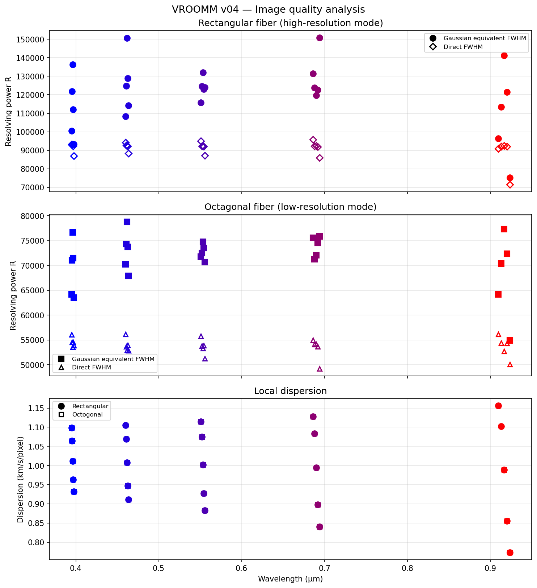

# LSF Nyquist Analysis

*How much of the spectrograph Line Spread Function is aliased by the detector?*

> **For the impatient:**
> ```bash
> git clone https://github.com/eartigau/nyquist_lsf.git
> cd nyquist_lsf
> pip install numpy matplotlib scipy pyyaml
> python lsf_nyquist.py
> ```
> Four PNG figures appear in the folder.  Everything you can customise lives in `config.yaml`.

---

## Table of Contents

1. [What this code does](#1-what-this-code-does)
2. [The physics — what is Nyquist aliasing?](#2-the-physics--what-is-nyquist-aliasing)
3. [Prerequisites](#3-prerequisites)
4. [Getting the code](#4-getting-the-code)
5. [Running the code](#5-running-the-code)
6. [Configuration — `config.yaml`](#6-configuration--configyaml)
7. [Understanding the output figures](#7-understanding-the-output-figures)
8. [Using your own data](#8-using-your-own-data)
9. [Key results at a glance](#9-key-results-at-a-glance)
10. [FAQ / Troubleshooting](#10-faq--troubleshooting)

---

## 1. What this code does

A spectrograph disperses light onto a 2-D detector.  Each spectral line
produces a small blob on the detector called a **Point Spread Function (PSF)**.
If you collapse the PSF along the slit direction you get a 1-D profile called
the **Line Spread Function (LSF)**.  The LSF is the spectrograph's impulse
response in the wavelength direction: the sharper (narrower) it is, the better
your spectral resolution.

But the LSF is not sampled continuously — it is sampled by discrete detector
pixels.  The Nyquist–Shannon theorem tells us there is a maximum spatial
frequency the detector can faithfully measure.  Any LSF power *above* that
frequency leaks into lower frequencies, distorting the measured line profile.
This effect is called **aliasing**.

This code:

1. Reads simulated PSF maps exported from **Zemax** (a ray-tracing program).
2. Optimally rotates each PSF so the dispersion direction aligns with the
   pixel columns.
3. Collapses the PSF to a 1-D LSF.
4. Computes the **fraction of LSF power above the Nyquist frequency** — the
   aliased power — via an FFT.
5. Compares with a **Gaussian** of identical FWHM (via an exact analytic
   formula).
6. Repeats for all 25 simulated field positions and makes summary plots.

---

## 2. The physics — what is Nyquist aliasing?

### 2.1 Digital sampling and the Nyquist frequency

Imagine shining a laser line onto your detector.  The detector records one
number per pixel; it cannot see structure finer than one pixel.  The
**Nyquist–Shannon sampling theorem** says:

> To faithfully represent a signal that oscillates at frequency *f*, you need
> at least **2 samples per oscillation cycle**.

A pixel detector with pitch *p* gives you 1 sample per pixel, so the highest
frequency it can faithfully represent is:

$$f_N = \frac{1}{2p} = 0.5 \text{ cycles per pixel}$$

This is the **Nyquist frequency**.  Any information at frequencies above $f_N$
is *aliased*: it folds back into lower frequencies and scrambles the signal.
There is no way to undo aliasing after the fact.

### 2.2 Power above Nyquist = aliased power

Every LSF profile can be decomposed into spatial frequencies by a Fourier
transform.  The fraction of total power that lives above $f_N$ tells you
directly how badly the detector misrepresents the line profile:

$$f_{\rm aliased} = \frac{\displaystyle\int_{f_N}^{\infty} \bigl|\hat{L}(f)\bigr|^2\, df}
                          {\displaystyle\int_{0}^{\infty}  \bigl|\hat{L}(f)\bigr|^2\, df}$$

where $\hat{L}(f)$ is the Fourier transform of the LSF.

### 2.3 Three reference cases — and why the real LSF is different

| Profile | Aliased fraction | Why |
|---------|-----------------|-----|
| **Sinc** | **exactly 0 %** | A sinc has a *rectangular* Fourier transform: all power is within a finite band.  If you design the instrument so that band fits below $f_N$, aliasing is zero by construction. |
| **Gaussian** | **~10⁻²² – 10⁻⁵ %** | A Gaussian has a Gaussian Fourier transform, which decays *super-exponentially* ($\propto e^{-f^2}$).  It technically extends to infinite frequency, but the power is so small above $f_N$ that it is negligible in practice.  The exact formula is $f_{\rm aliased}^{\rm Gauss} = \mathrm{erfc}(2\pi\sigma f_N)$. |
| **Real rectangular-fiber LSF** | **0.01 – 1.5 %** | A rectangular fiber aperture casts a slit image with *sharp edges*.  Sharp edges Fourier-transform to a sinc function, which decays only as $1/f$ — far slower than $e^{-f^2}$.  These slow-decaying tails fill in the frequency space above $f_N$ and create measurable aliased power. |

The bottom line: **the real LSF has 5–9 orders of magnitude more aliased power
than a Gaussian with the same FWHM**.  The Gaussian approximation
dramatically under-estimates how much high-frequency content the actual slit
image contains.

### 2.4 Why the Zemax data are oversampled

Zemax simulations run on a fine grid so the details of the PSF are well
resolved.  For the data in this repository:

- Real detector pixel size: **12 µm**
- Zemax simulation pixel: **3 µm** (= 12/4)
- Oversampling factor: **4×**

This means one "simulation pixel" is one quarter of a real detector pixel.
When the code converts frequencies, it multiplies by the oversampling factor
to express everything in units of **cycles per real pixel**.  The Nyquist
limit is always 0.5 cycles per real pixel regardless of oversampling.

---

## 3. Prerequisites

You need **Python 3.9 or later** and four standard scientific packages.

### Option A — conda (recommended if you are new to Python)

[Anaconda](https://www.anaconda.com/products/distribution) or
[Miniconda](https://docs.conda.io/en/latest/miniconda.html) includes
everything you need:

```bash
conda create -n nyquist python=3.11 numpy matplotlib scipy pyyaml
conda activate nyquist
```

### Option B — pip (if you already have Python installed)

```bash
pip install numpy matplotlib scipy pyyaml
```

To check everything is installed correctly:

```bash
python -c "import numpy, matplotlib, scipy, yaml; print('All good!')"
```

---

## 4. Getting the code

### Option A — git clone (easiest to update later)

If you have `git` installed:

```bash
git clone https://github.com/eartigau/nyquist_lsf.git
cd nyquist_lsf
```

### Option B — download a ZIP

1. Go to the GitHub repository page.
2. Click the green **"Code"** button near the top right.
3. Click **"Download ZIP"**.
4. Unzip the file somewhere convenient.
5. Open a terminal and `cd` into the unzipped folder.

To verify you are in the right place:

```bash
ls
```

You should see `lsf_nyquist.py`, `config.yaml`, and the
`VROOMM_v04_rectangular_fiber/` data folder.

---

## 5. Running the code

From inside the repository folder:

```bash
python lsf_nyquist.py
```

The script will print its progress to the terminal and save four PNG figures.
A typical run takes about 30–60 seconds (most of the time is spent finding the
optimal rotation angle for each of the 25 PSFs).

Expected output:

```
Configuration loaded from config.yaml:
  example_file      : VROOMM_v04_rectangular_fiber/R1553.txt
  data_dir          : VROOMM_v04_rectangular_fiber
  detector_pixel_um : 12.0 µm
  sim_pixel_um      : 3.0 µm
  oversample        : 4.00×  (4× integer)
  n_fft             : 512
  output_dir        : /path/to/nyquist_lsf

Loading example PSF: VROOMM_v04_rectangular_fiber/R1553.txt
Finding optimal rotation angle ...
  Optimal rotation : -7.97 °
  LSF FWHM         : 12.71 sim px  =  3.18 real px
  Aliased power — real LSF       : 0.6308 %
  Aliased power — Gaussian (analytic, erfc): 2.037e-07 %
  Aliased power — sinc           : 0.0000 %  (band-limited by definition)
Saved  fig_01_psf_rotation.png
...
```

---

## 6. Configuration — `config.yaml`

**All user-adjustable inputs live in `config.yaml`.**
Open it in any text editor.  Do not edit the Python source code.

Here is the file with detailed explanations of every parameter:

```yaml
# ── Data sources ───────────────────────────────────────────────────────────────

# Path to a single PSF file for the detailed single-case demo (Figures 1–3).
example_file: VROOMM_v04_rectangular_fiber/R1553.txt

# Folder for the batch analysis over all PSFs (Figure 4).
# Must contain R{order}{field}.txt files + one *_XY.txt companion file.
data_dir: VROOMM_v04_rectangular_fiber


# ── Detector geometry ──────────────────────────────────────────────────────────

# Physical size of one real detector pixel in micrometres.
# Check your detector's datasheet.  Typical values: 12–18 µm.
detector_pixel_um: 12.0


# ── Zemax simulation geometry ──────────────────────────────────────────────────

# Physical size of one Zemax simulation pixel in micrometres.
# Formula: sim_pixel_um = image_field_width_mm / n_pixels × 1000
# You can read image_field_width_mm and n_pixels from the header of any .txt file.
#
# Example (VROOMM v04):
#   Image Width = 0.24 mm,  Number of pixels = 80 × 80
#   sim_pixel_um = 0.24 / 80 × 1000 = 3.0 µm
#
# The code computes:  oversample = detector_pixel_um / sim_pixel_um
# A warning is printed if this is not close to a whole number.
sim_pixel_um: 3.0

# Number of header lines in each Zemax ASCII file before the data matrix.
# Count the lines above the first block of numbers in any .txt file.
zemax_header_lines: 17


# ── FFT settings ───────────────────────────────────────────────────────────────

# Zero-padding length for the power-spectrum curves in Figs. 2–3.
# rule of thumb: 512 gives smooth curves; 1024 if you want extra detail.
# Must be >= number of sim pixels across one PSF (typically 80).
n_fft: 512


# ── Output ─────────────────────────────────────────────────────────────────────

# Folder where the four PNG figures are written.
# Use  .  for the current directory, or give an absolute/relative path.
output_dir: .
```

### How to find `sim_pixel_um` from a Zemax file

Open any `.txt` file in the data folder (e.g. `R1553.txt`) in a text editor.
The first ~17 lines look like this:

```
Image analysis histogram listing

File : C:\Users\...\design.ZMX
Title:
Date : 26/02/2026

Field Width  : 0.231 Millimeters
Image Width  : 0.24 Millimeters     ← use this number
Number of pixels  : 80 x 80         ← and this number
...
```

Then:

$$\text{sim\_pixel\_um} = \frac{\text{Image Width (mm)}}{\text{n\_pixels}} \times 1000
= \frac{0.24}{80} \times 1000 = 3.0 \; \mu\text{m}$$

---

## 7. Understanding the output figures

### Figure 1 — `fig_01_psf_rotation.png`


This figure shows the three steps needed to go from a 2-D PSF to a 1-D LSF.

- **Panel (a) — Raw PSF:** The PSF as Zemax simulates it.  The slit image
  is elongated diagonally because the rectangular fiber aperture is tilted
  on the detector by spectrograph anamorphism.

- **Panel (b) — Rotated PSF:** The same PSF after rotating by the optimal
  angle (−8° in this example).  Now the long axis of the slit image is
  horizontal, aligned with the detector columns.

- **Panel (c) — 1-D LSF:** The PSF is collapsed along the vertical (slit)
  direction by summing every row.  This gives the 1-D spectral profile.
  The FWHM double arrow shows the measured width.

> **Why rotate?**  If you collapse a tilted PSF without rotating first, you
> artificially smear the LSF.  The rotation step ensures the extracted LSF
> truly represents the spectrograph's spectral resolution and not a
> projection artefact.

---

### Figure 2 — `fig_02_lsf_profiles.png`


The observed LSF (blue) plotted alongside a **Gaussian with the same FWHM**
(red dashed), both normalised to unit area.

At first glance they look almost identical.  The difference is in the
**wings** — the faint tails on either side of the peak.  The Gaussian wings
fall off as $e^{-x^2}$; the real LSF wings come from the sharp rectangular
aperture and fall off more slowly, like $1/x^2$.  These apparently tiny
differences in the wings contain most of the aliased power.

---

### Figure 3 — `fig_03_power_spectra.png`


This is the central diagnostic figure.

**Top panel — power spectral density (log scale):**

- The horizontal axis is **spatial frequency in cycles per real pixel**.
- The green dashed vertical line is the **detector Nyquist frequency**
  ($f_N = 0.5$ cycles/pixel).
- The red-shaded area to the right shows the **aliased zone** — any power
  here cannot be measured correctly.
- Both the real LSF (blue) and Gaussian (red) carry negligible power at low
  frequencies, but the real LSF's power falls off more slowly and visibly
  leaks into the aliased zone.

**Bottom panel — cumulative aliased power:**

- The vertical axis is "what fraction of the total LSF power lives at
  frequencies **above this point** on the horizontal axis".
- Reading at $f_N = 0.5$ gives the aliased fraction for the real detector.
- The **Gaussian curve** (red) plunges to $\sim 10^{-7}$ % before reaching
  $f_N$ — effectively zero on any practical scale.
- The **sinc** (ideal band-limited signal) would drop to *exactly* zero at
  the green line.
- The **real LSF** (blue) runs $\sim 10^6$–$10^7 \times$ higher than the
  Gaussian, landing at 0.6 % in this example.

> **How to read this plot:**
> Pick any Nyquist frequency on the horizontal axis.  The value of each
> curve at that frequency is the aliased-power fraction for a detector with
> that sampling rate.  Moving the green line to the right (more pixels per
> resolution element) reduces aliasing exponentially for the Gaussian and
> more slowly for the real LSF.

---

### Figure 4 — `fig_04_summary.png`


The analysis repeated for all 25 PSFs (5 diffraction orders × 5 field
positions), plotted as a function of wavelength.

**Top panel — aliased fraction (log scale):**
- **Solid circles** = real LSF measured from FFT.
- **Open squares** = matched Gaussian (analytic erfc formula).
- Each colour is a different diffraction order (see legend).
- The real LSF is consistently 5–9 orders of magnitude above the Gaussian.
- Aliasing varies across the focal plane (different wavelengths and orders)
  because the PSF shape changes with aberrations.

**Bottom panel — FWHM in real pixels:**
- Narrower LSFs (fewer pixels/FWHM) tend to have more aliased power because
  their Fourier transforms extend to higher frequencies.

---

## 8. Using your own data

To run on different Zemax PSF data, you only need to edit `config.yaml`.
No Python needed.

### Step-by-step

1. Export your PSF maps from Zemax as **Image Analysis → ASCII** files
   (same format as the provided data).

2. Put them all in a folder, e.g. `my_spectrograph/`.

3. Create a companion `_XY.txt` file with one row per PSF and four columns:
   ```
   order   wavelength_µm   x_detector_mm   y_detector_mm
   ```
   (The first line is a header comment — it is skipped.)

4. Open `config.yaml` and change:
   ```yaml
   example_file: my_spectrograph/R1553.txt   # or whichever file you want
   data_dir:     my_spectrograph
   detector_pixel_um: 15.0    # your detector's pixel pitch
   sim_pixel_um:       3.75   # from your Zemax image width / n_pixels
   zemax_header_lines: 17     # count lines before the data matrix
   ```

5. Run `python lsf_nyquist.py` again.

### How to find `sim_pixel_um` for your Zemax export

Open any one of your `.txt` PSF files.  Near the top you will see lines like:

```
Image Width  : 0.30 Millimeters
Number of pixels  : 100 x 100
```

Then: `sim_pixel_um = 0.30 / 100 × 1000 = 3.0 µm`.

---

## 9. Key results at a glance

| | Sinc | Gaussian | Real rectangular-fiber LSF |
|--|------|----------|---------------------------|
| Theoretical aliased power | 0 % | erfc(2πσ f_N) | (computed numerically) |
| Typical value (FWHM ≈ 3 px) | **0 %** | **~2×10⁻⁷ %** | **0.01–1.5 %** |
| FT decay rate | step (finite support) | $e^{-f^2}$ (super‑exp.) | $1/f$ (sinc‑like, slow) |
| Orders of magnitude above Gaussian | — | 0 | **5–9** |

**Take-home message:** The rectangular fiber aperture creates sharp slit
edges whose sinc-like Fourier transform decays far more slowly than a
Gaussian.  These high-frequency tails fill the aliased zone well above what
you would estimate by modelling the LSF as Gaussian.  The aliased fraction
(0.01–1.5 %) may seem small, but for precision radial-velocity work where
sub-pixel line-profile changes are tracked, it is worth quantifying and
understanding.

---

## 10. FAQ / Troubleshooting

**Q: `ModuleNotFoundError: No module named 'yaml'`**

Install PyYAML:
```bash
pip install pyyaml
```

---

**Q: `config.yaml not found`**

Make sure you are running Python from inside the repository folder:
```bash
cd /path/to/nyquist_lsf
python lsf_nyquist.py
```
The script looks for `config.yaml` in the same directory as itself.

---

**Q: `WARNING: oversampling factor is not a whole number`**

Double-check that `detector_pixel_um` and `sim_pixel_um` are consistent with
your Zemax export.  The formula is:

```
sim_pixel_um = (Image Width in mm) / (number of pixels) × 1000
```

A non-integer oversampling means the pixel grids don't align and the
frequency-axis conversion will be slightly off.

---

**Q: The script takes too long**

Most of the time is in `find_optimal_rotation`, which calls `scipy.optimize`
for each of the 25 PSFs.  You cannot avoid this step for tilted-slit PSFs.
On a modern laptop it finishes in under a minute.

---

**Q: My `aliased_fraction` for the real LSF is 0 % too**

This can happen if the LSF is very broad (large FWHM relative to the pixel
scale).  A broad LSF concentrates all its power at low frequencies well below
Nyquist.  Check that `oversample` is set correctly in `config.yaml` and that
the PSF file is the one you intended.

---

**Q: Can I use this for an octagonal / circular fiber?**

Yes.  For a circularly symmetric fiber the PSF is not tilted, so no rotation
is needed.  Set `example_file` and `data_dir` to your octagonal-fiber folder
and run as normal.  The rotation angle found will be near 0°.

---

## Dependencies

| Package | Purpose |
|---------|---------|
| `numpy` | Array operations, FFT |
| `matplotlib` | Figures |
| `scipy` | PSF rotation (`ndimage.rotate`), 1-D optimiser (`optimize.minimize_scalar`), `erfc` for analytic Gaussian reference |
| `pyyaml` | Reading `config.yaml` |

---

## Overview

This repository analyses the **Line Spread Function (LSF)** of a spectrograph
using Zemax-simulated Point Spread Functions (PSFs), and answers a concrete
question:

> **What fraction of the LSF's power sits at spatial frequencies that the
> detector cannot faithfully sample?**

We compare three idealised LSF shapes:

| Profile | Aliased power | Why |
|---------|--------------|-----|
| **Sinc** | **0 %** exactly | Band-limited by construction — all power within Nyquist |
| **Gaussian** | ~10⁻²² – 10⁻⁵ % | Infinite bandwidth, but FT decays super-exponentially |
| **Real (Zemax) LSF** | **0.01 – 1.5 %** | Non-Gaussian wings from the rectangular fiber aperture |

The real rectangular-fiber LSF has **millions of times more aliased power** than
a Gaussian with the same FWHM — not because the Gaussian is "safer" in theory,
but because the rectangular aperture injects high-frequency content (its Fourier
transform is a sinc, which decays slowly) that fills in the frequency space above
Nyquist far more than a smooth Gaussian would.

---

## Background: Nyquist Sampling for Spectrographs

### What is Nyquist sampling?

A CCD/detector samples the focal-plane image at discrete pixels of width $p$.
The **Nyquist–Shannon sampling theorem** says that the detector can faithfully
represent any spatial structure finer than $2p$ (one full oscillation per 2
pixels), but all structure finer than that is **aliased**: it folds back into
lower frequencies and corrupts the measurement.

The **Nyquist frequency** is:

$$f_N = \frac{1}{2p} = 0.5 \text{ cycles per pixel}$$

### Power above Nyquist = aliased power

Every LSF profile has a **Fourier transform** (a power spectrum in spatial
frequency). Whatever fraction of the total LSF power lies above $f_N$ will be
mis-represented by the detector:

$$f_{\rm aliased} = \frac{\int_{f_N}^{\infty} |\hat{L}(f)|^2 \, df}{\int_{0}^{\infty} |\hat{L}(f)|^2 \, df}$$

where $\hat{L}(f)$ is the Fourier transform of the LSF.

### The three reference cases

**1. Sinc LSF — 0 % aliased**

A sinc profile in real space, $L(x) = \mathrm{sinc}(\pi x / W)$, has a
*rectangular* Fourier transform that is exactly zero above some bandwidth
$B = 1/(2W)$. If $W$ is chosen so that $B \leq f_N$, then by construction
*no power is above Nyquist*. A band-limited signal is the ideal case.

**2. Gaussian LSF — tiny but non-zero**

A Gaussian profile $L(x) = e^{-x^2/(2\sigma^2)}$ has a Gaussian Fourier
transform $|\hat{L}(f)|^2 = e^{-4\pi^2\sigma^2 f^2}$ that decays
super-exponentially but *never reaches zero*. The aliased fraction has an
exact closed-form expression:

$$f_{\rm aliased}^{\rm Gauss} = \mathrm{erfc}(2\pi\sigma f_N)$$

where $\mathrm{erfc}$ is the complementary error function. For a Gaussian
with FWHM $\approx 3$ real pixels (typical of these LSFs), $\sigma \approx
1.35$ px, giving $f_{\rm aliased} \approx 2 \times 10^{-7}$ % — so tiny it
is effectively zero in any practical sense.

**3. Real spectrograph LSF — hundreds of millions times more**

A real spectrograph LSF inherits structure from the fiber aperture. For a
**rectangular fiber**, the projected slit image has sharp edges whose Fourier
transform decays only as $1/f$ (sinc-like), not as $e^{-f^2}$. These edges
fill in the high-frequency tail far above Nyquist, giving aliased fractions
of 0.01–1.5 % for the VROOMM v04 design.

---

## Data

The `VROOMM_v04_rectangular_fiber/` folder contains:
- **25 Zemax PSF maps** (`R{order}{field}.txt`) — 80×80 pixel maps at 4×
  oversampling (1 sim pixel = 0.25 real detector pixel = 3 µm physical)
- **Companion coordinate file** (`*_XY.txt`) — order, wavelength, and
  detector position for each field point

The 25 PSFs span 5 diffraction orders (67, 89, 111, 133, 155) over
**0.39–0.92 µm**, with 5 field positions per order.

> **Testing with different LSFs:** Keep the data folder as-is and simply
> change the `EXAMPLE_FILE` and `DATA_DIR` variables at the top of
> `lsf_nyquist.py` to point at any other Zemax export directory with the
> same file structure.

---

## Method

### Step 1 — Rotate the PSF optimally

The rectangular fiber produces a PSF that is *tilted* on the detector (the
slit is not aligned with pixel rows due to spectrograph anamorphism). Before
extracting the 1-D LSF, each 2-D PSF is rotated to align the dispersion
direction with the pixel columns.

The optimal angle is found by maximising the **sum of squared gradients** of
the column-collapsed profile:

$$\theta^* = \arg\max_\theta \sum_x \left[\frac{d}{dx} \sum_y P_\theta(x, y)\right]^2$$

This quantity is maximised when the LSF has the sharpest possible edges —
i.e., when the dispersion axis is exactly parallel to the pixel columns.


*Panel (a): raw PSF in its native orientation. Panel (b): optimally rotated
PSF (by −8° in this example). Panel (c): 1-D LSF extracted by collapsing the
rotated PSF along the slit axis. The FWHM is measured by half-maximum
interpolation.*

---

### Step 2 — Compare with a Gaussian of the same FWHM

Once the 1-D LSF is extracted, we construct a **Gaussian with the same FWHM**
to serve as a reference. Both profiles are plotted normalised to unit sum.


*The observed LSF (blue) and its matched Gaussian (red dashed) have identical
FWHMs. They look nearly identical in real space — the key difference is in
the wings, which are responsible for the high-frequency power content.*

---

### Step 3 — Fourier analysis and Nyquist cut

The LSF and Gaussian are Fourier-transformed and their power spectra compared.
The **Nyquist frequency** $f_N = 0.5$ cycles/real pixel is marked; any power
to the right of this line is aliased.

The lower panel shows **"fraction of total power above frequency $f$"** — a
cumulative diagnostic that answers the question: at any given detector sampling
rate, what fraction of the signal is unsampled?


*Top: power spectral density on a log scale. Both profiles are nearly
identical at low frequencies; the Gaussian falls off faster and the real LSF
has a visible tail above Nyquist (red-shaded zone).*

*Bottom: reading the curve at $f_N = 0.5$ (green dashed line) gives the
aliased power fraction. The Gaussian fraction ($\sim 10^{-7}$ %) is so small
it stays below the plot floor; the sinc would fall to exactly 0 at that line;
the real LSF sits at ~0.6 % for this particular field point.*

---

### Step 4 — Batch over all 25 LSFs

The analysis is repeated for all 25 PSFs, giving aliased fraction and FWHM
as a function of wavelength for every diffraction order.


*Top: aliased power fraction (%) on a log scale. Solid circles = real LSF;
open squares = matched Gaussian (analytic erfc formula). The real LSF is
consistently 5–9 orders of magnitude above the Gaussian reference.*

*Bottom: LSF FWHM (real pixels) across orders and wavelengths.*

---

## Key results

| | Sinc | Gaussian (same FWHM) | Real LSF |
|--|------|---------------------|----------|
| Aliased at f > 0.5 cyc/px | 0 % | ~10⁻²² – 10⁻⁵ % | **0.01 – 1.5 %** |
| Frequency-space property | rect (finite support) | Gaussian (super-exp decay) | sinc-like tails (slow 1/f decay) |

The take-away: **the rectangular fiber aperture introduces sinc-like tails in
the LSF's Fourier transform that are 5–9 orders of magnitude larger than the
Gaussian approximation predicts.** The Nyquist aliasing is non-zero and may
matter for precision line-profile work, despite appearing small on a linear
scale.

---

## Running the code

```bash
pip install numpy matplotlib scipy
python lsf_nyquist.py
```

Produces four PNG figures in the working directory.

To test a different LSF, edit the top of `lsf_nyquist.py`:

```python
EXAMPLE_FILE = 'VROOMM_v04_rectangular_fiber/R1553.txt'  # single-PSF demo
DATA_DIR     = 'VROOMM_v04_rectangular_fiber'            # batch folder
```

The code is intentionally general: any directory of Zemax Image Analysis
ASCII exports (80×80, 17-line header) with an `*_XY.txt` companion file will
work.

---

## Dependencies

- **numpy** — array operations and FFT
- **matplotlib** — figures
- **scipy** — PSF rotation (`ndimage.rotate`), bounded 1-D optimiser,
  `erfc` analytic Gaussian reference



---

## File Structure

```
VROOMM_v04_rectangular_fiber/       # High-resolution mode PSFs
    R{order}{1-5}.txt               # 80×80 Zemax ASCII maps (e.g., R1554.txt)
    VROOMM_v04_rectangular_fiber_XY.txt  # Order, wavelength, x, y positions

VROOMM_v04_octogonal_fiber/         # Low-resolution mode PSFs
    R{order}{1-5}.txt
    VROOMM_v04_octogonal_fiber_XY.txt

read_zemax_map.py                   # Analysis pipeline (this code)
```

### Zemax ASCII Format

Each `R*.txt` file contains:
- **17-line header**: Zemax metadata (ray trace config, field/image widths, pixel count)
- **80 × 80 data block**: Tab-separated flux values in scientific notation

### XY File Format

Each `_XY.txt` file has 25 rows (5 orders × 5 positions):

| Column | Content |
|--------|---------|
| 0 | Diffraction order (67, 89, 111, 133, 155) |
| 1 | Wavelength (µm) |
| 2 | x position on detector (mm) |
| 3 | y position on detector (mm) |

---

## Usage

```bash
python read_zemax_map.py
```

This runs the full pipeline:
1. Reads all 50 PSFs (25 per fiber type)
2. Finds optimal rotation angles (rectangular fiber only)
3. Extracts 1D LSF profiles
4. Computes Gaussian equivalent and direct FWHM
5. Converts to resolving power using local dispersion
6. Generates three PNG plots

### As a library

```python
from read_zemax_map import read_zemax_map, rotate_psf, find_optimal_rotation, match_gaussian_to_lsf, measure_fwhm

# Read a single PSF
psf = read_zemax_map('VROOMM_v04_rectangular_fiber/R1554.txt')

# Find optimal rotation and extract LSF
angle = find_optimal_rotation(psf)
psf_rot = rotate_psf(psf, angle)
lsf = psf_rot.sum(axis=0)

# Gaussian equivalent (Bouchy 2001)
result = match_gaussian_to_lsf(lsf)
print(f"FWHM = {result['fwhm']:.2f} sim pixels")

# Direct FWHM
fwhm_direct = measure_fwhm(lsf)
```

---

## Dependencies

- Python ≥ 3.10
- NumPy
- Matplotlib
- SciPy
